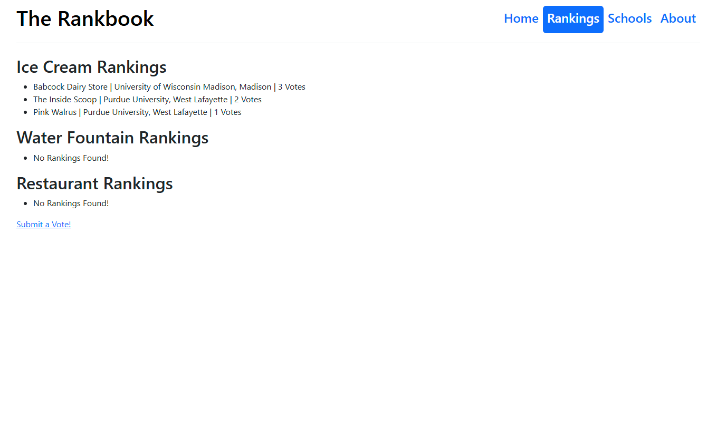

<!-- PROJECT LOGO -->
 

  

  <h3 align="center">The Rankbook</h3>

  

    A website for ranking colleges on wacky metrics!

<!-- ABOUT THE PROJECT -->
## About The Project

This project is a website for ranking colleges based on factors that probably shouldn't influence any attendance decisions, but are good to know nonetheless!

Libraries used:
* Django for backend
* Bootstrap for frontend
